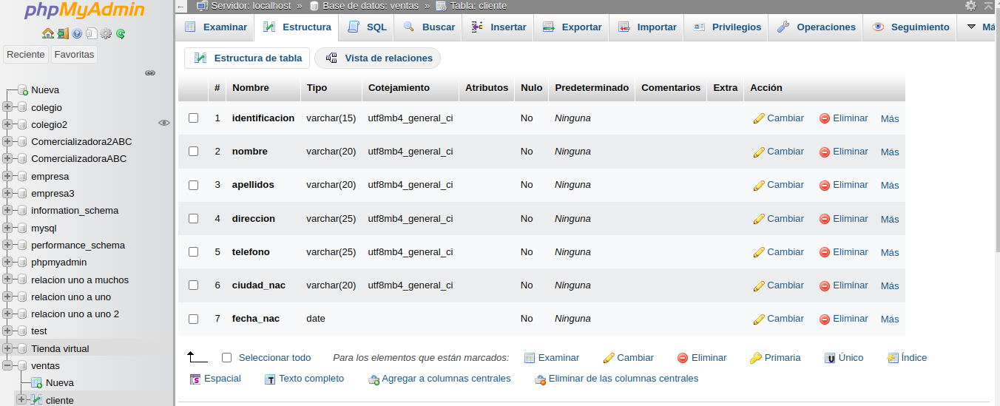
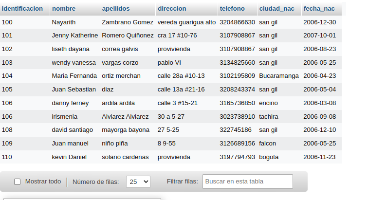

# INTRODUCCION A SQL

1. Creacion de una base datos (BD) con MySQL usando phpMyAdmin

## Creacion tabla cliente

### Diccionario de datos

| Campo                | Tipo de dato | Longitud |
| -------------------- | ------------ | -------- |
| **_identificacion_** | varchar      | 15       |
| nombre               | varchar      | 20       |
| apellidos            | varchar      | 20       |
| direccion            | varchar      | 25       |
| telefono             | varchar      | 20       |
| ciudad_nac           | varchar      | 20       |
| fecha_nac            | date         |          |

### Codigo SQL de creacion de la tabla Ventas

CREATE TABLE `Ventas`.`Cliente` (`identificacion` VARCHAR(15) NOT NULL , `nombre` VARCHAR(20) NOT NULL , `apellidos` VARCHAR(20) NOT NULL , `direccion` VARCHAR(25) NOT NULL , `telefono` VARCHAR(25) NOT NULL , `ciudad_nac` VARCHAR(20) NOT NULL , `fecha_nac` DATE NOT NULL , PRIMARY KEY (`identificacion`)) ENGINE = InnoDB;

### Diccionario de datos en phpMyAdmin

### Registro de Datos en tabla cliente 

INSERT INTO `Cliente` (`identificacion`, `nombre`, `apellidos`, `direccion`, `telefono`, `ciudad_nac`, `fecha_nac`) VALUES ('100', 'Nayarith', 'Zambrano Gomez ', 'vereda guarigua alto, '3204866630', 'San gil', '2006-12-30');

